Bulk RNA-sequencing pipeline and differential gene expression analysis
================
Erick Lu

March 1, 2020

-   [Introduction](#introduction)
-   [Obtaining raw data from GEO](#obtaining-raw-data-from-geo)
    -   [Download FASTQ files using SRA tools](#download-fastq-files-using-sra-tools)
    -   [Concatenating FASTQ files](#concatenating-fastq-files)
-   [Mapping reads using STAR](#mapping-reads-using-star)
    -   [Concepts behind mapping reads](#concepts-behind-mapping-reads)
    -   [Building the genome index](#building-the-genome-index)
    -   [Mapping reads](#mapping-reads)
    -   [Understanding ReadsPerGene.out.tab](#understanding-readspergene.out.tab)
    -   [Selecting read counts by sample](#selecting-read-counts-by-sample)
-   [Differential expression analysis](#differential-expression-analysis)
    -   [Creating the DESeq2 object](#creating-the-deseq2-object)
    -   [Making an annotation file from BioMart](#making-an-annotation-file-from-biomart)
-   [Visualizations for sample variability](#visualizations-for-sample-variability)
    -   [1. Distance Plot](#distance-plot)
    -   [2. Variable Genes Heatmap](#variable-genes-heatmap)
    -   [3. PCA Plot](#pca-plot)
-   [Making subsetted DESeq2 objects](#making-subsetted-deseq2-objects)
-   [Extracting DE results](#extracting-de-results)
-   [Visualizations for DE results](#visualizations-for-de-results)
    -   [1. PlotCounts (upgraded)](#plotcounts-upgraded)
    -   [2. Differential gene heatmap](#differential-gene-heatmap)
    -   [3. Volcano Plot](#volcano-plot)
    -   [4. LogFoldChange comparison plot](#logfoldchange-comparison-plot)
    -   [5. Gene set enrichment analysis](#gene-set-enrichment-analysis)
-   [Conclusion](#conclusion)

Introduction
------------

RNA-sequencing is a powerful technique that can assess differences in global gene expression between groups of samples. For example, it can be used to:

-   Identify differences between knockout and control samples
-   Understand the effects of treating cells/animals with therapeutics
-   Observe the gene expression changes that occur across development

However, processing raw sequencing data and performing differential gene expression analysis can be daunting for researchers with limited experience in programming. My goal is to help researchers learn how to analyze bulk RNA-sequencing data by providing code, explanations, and the expected output for each step of the process. Here, I present an example of a complete bulk RNA-sequencing pipeline which includes:

1.  Finding and downloading raw data from GEO using NCBI SRA tools and Python
2.  Mapping FASTQ files using STAR
3.  Differential gene expression analysis using DESeq2
4.  Visualizations for bulk RNA-seq results

If you are performing your own RNA-seq experiment and have obtained raw data from your sequencing facility, you can start this guide from the section: [Mapping reads using STAR](#mapping-reads-using-star).

Obtaining raw data from GEO
---------------------------

The dataset that we will be working with comes from [Guo et al. Nature Communications 2019](https://www.ncbi.nlm.nih.gov/pubmed/30655535). To find the raw sequencing data, we can navigate through the Gene Expression Omnibus (GEO) using the accession number provided in the publication: GSE106305. The GEO page corresponding to this accession number is <https://www.ncbi.nlm.nih.gov/geo/query/acc.cgi?acc=GSE106305>. On this webpage, there is information about where the sequencing data for each sample in the study is stored.

Our goal is to find differentially expressed genes in response to hypoxia for the LNCaP and PC3 cell lines. Therefore, we will select the control samples for both cell lines (Empty\_Vector for LNCaP and siCtrl for PC3) in conditions of either normoxia or hypoxia. The specific samples we need to download are outlined in the table below:

<table>
<colgroup>
<col width="15%" />
<col width="14%" />
<col width="22%" />
<col width="47%" />
</colgroup>
<thead>
<tr class="header">
<th>Sample Name</th>
<th>GSM Identifier</th>
<th>SRA Identifier (SRX)</th>
<th>SRA Runs (SRR, download these)</th>
</tr>
</thead>
<tbody>
<tr class="odd">
<td>LNCaP_RNA-Seq_Empty_Vector_Normoxia_rep1</td>
<td>GSM3145509</td>
<td>SRX4096735</td>
<td>SRR7179504, SRR7179505, SRR7179506, and SRR7179507</td>
</tr>
<tr class="even">
<td>LNCaP_RNA-Seq_Empty_Vector_Normoxia_rep2</td>
<td>GSM3145510</td>
<td>SRX4096736</td>
<td>SRR7179508, SRR7179509, SRR7179510, and SRR7179511</td>
</tr>
<tr class="odd">
<td>LNCaP_RNA-Seq_Empty_Vector_Hypoxia_rep1</td>
<td>GSM3145513</td>
<td>SRX4096739</td>
<td>SRR7179520, SRR7179521, SRR7179522, and SRR7179523</td>
</tr>
<tr class="even">
<td>LNCaP_RNA-Seq_Empty_Vector_Hypoxia_rep2</td>
<td>GSM3145514</td>
<td>SRX4096740</td>
<td>SRR7179524, SRR7179525, SRR7179526, and SRR7179527</td>
</tr>
<tr class="odd">
<td>PC3_RNA-Seq_siCtrl_Normoxia_rep1</td>
<td>GSM3145517</td>
<td>SRX4096743</td>
<td>SRR7179536</td>
</tr>
<tr class="even">
<td>PC3_RNA-Seq_siCtrl_Normoxia_rep2</td>
<td>GSM3145518</td>
<td>SRX4096744</td>
<td>SRR7179537</td>
</tr>
<tr class="odd">
<td>PC3_RNA-Seq_siCtrl_Hypoxia_rep1</td>
<td>GSM3145521</td>
<td>SRX4096747</td>
<td>SRR7179540</td>
</tr>
<tr class="even">
<td>PC3_RNA-Seq_siCtrl_Hypoxia_rep2</td>
<td>GSM3145522</td>
<td>SRX4096748</td>
<td>SRR7179541</td>
</tr>
</tbody>
</table>

The NCBI stores sequencing data in the form of Sequence Read Archive (SRA) files. Each of the samples is associated with a set of SRA accession numbers, indicated above. First, we need to download the SRA runs for each sample. Then, we will use the SRA files to generate FASTQ files. The FASTQ file is the data format required for bulk RNA-sequencing analysis.

### Download FASTQ files using SRA tools

To download the SRA files onto our machine, we will use the NCBI's SRA toolkit. If you are using linux, you can type: `sudo apt install sra-toolkit` in your command line to install the toolkit. You can read more about SRA toolkit here: <https://www.ncbi.nlm.nih.gov/books/NBK242621/>.

The toolkit works by first using the `prefetch` command to download the SRA file associated with the specified SRA ID. The SRA file contains a set of "instructions" for downloading the sequencing data associated with the SRA ID from NCBI. For example, to download the first SRA run for LNCaP\_RNA-Seq\_Empty\_Vector\_Normoxia\_rep1, we would write:

``` bash
prefetch SRR7179504
```

    2020-02-14T22:15:36 prefetch.2.8.2: 1) Downloading 'SRR7179504'...
    2020-02-14T22:15:36 prefetch.2.8.2:  Downloading via https...
    2020-02-14T22:18:39 prefetch.2.8.2: 1) 'SRR7179504' was downloaded successfully
    2020-02-14T22:18:39 prefetch.2.8.2: 'SRR7179504' has 0 unresolved dependencies

This will download the file `SRR7179504.sra` into our home directory at ~/ncbi/public/sra/. We can now use `fastq-dump` to extract the contents of it into a FASTQ file. The Edwards lab at SDSU provides a nice tutorial for how to use fastq-dump here: <https://edwards.sdsu.edu/research/fastq-dump/>. To create the FASTQ file for SRR7179504, we would write:

``` bash
fastq-dump --outdir fastq --gzip --skip-technical  --readids --read-filter pass --dumpbase --split-3 --clip ~/ncbi/public/sra/SRR7179504.sra
```

    Rejected 13548432 READS because of filtering out non-biological READS
    Read 13548432 spots for /home/ericklu/ncbi/public/sra/SRR7179504.sra
    Written 13548432 spots for /home/ericklu/ncbi/public/sra/SRR7179504.sra

This will create a file called `SRR7179504_pass.fastq.gz` in a subdirectory called `fastq` inside the directory where fastq-dump was called. The ".gz" just means that the file is compressed.

Since there are many SRA runs associated with our samples, it would take a long time to manually run `prefetch` and `fastq-dump` for each run. To automate all the downloads, I wrote a small script in Python to call `fastq-dump` on each of the SRA runs we want. The code is shown below and also provided in this repo as `fastq_download.py`:

``` py
import subprocess

sra_numbers = [
    "SRR7179504", "SRR7179505", "SRR7179506", "SRR7179507",
    "SRR7179508", "SRR7179509", "SRR7179510", "SRR7179511",
    "SRR7179520", "SRR7179521", "SRR7179522", "SRR7179523",
    "SRR7179524", "SRR7179525", "SRR7179526", "SRR7179527",
    "SRR7179536", "SRR7179537", "SRR7179540","SRR7179541"
    ]

# this will download the .sra files to ~/ncbi/public/sra/ (will create directory if not present)
for sra_id in sra_numbers:
    print ("Currently downloading: " + sra_id)
    prefetch = "prefetch " + sra_id
    print ("The command used was: " + prefetch)
    subprocess.call(prefetch, shell=True)

# this will extract the .sra files from above into a folder named 'fastq'
for sra_id in sra_numbers:
    print ("Generating fastq for: " + sra_id)
    fastq_dump = "fastq-dump --outdir fastq --gzip --skip-technical  --readids --read-filter pass --dumpbase --split-3 --clip ~/ncbi/public/sra/" + sra_id + ".sra"
    print ("The command used was: " + fastq_dump)
    subprocess.call(fastq_dump, shell=True)
```

We can run the Python script by simply navigating to the folder on your machine where you want to store the FASTQ files (via the command line), then running `python fastq_download.py`. After running the Python script, all the FASTQ files should be sitting in a directory called 'fastq'. If you would like more information about navigating through GEO and downloading SRA Runs, you can check out my other [repo](https://erilu.github.io/python-fastq-downloader/).

### Concatenating FASTQ files

Each of the LNCaP samples was associated with four SRA runs, which means that we obtained four resulting FASTQ files for each sample after running `fastq_download.py`. For each sample, we should concatenate the four files into a single FASTQ file by using the command `cat`. Below, I perform the concatenation for each of the LNCaP samples:

``` bash
cat SRR7179504_pass.fastq.gz SRR7179505_pass.fastq.gz SRR7179506_pass.fastq.gz SRR7179507_pass.fastq.gz  > LNCAP_Normoxia_S1.fastq.gz
cat SRR7179508_pass.fastq.gz SRR7179509_pass.fastq.gz SRR7179510_pass.fastq.gz SRR7179511_pass.fastq.gz  > LNCAP_Normoxia_S2.fastq.gz
cat SRR7179520_pass.fastq.gz SRR7179521_pass.fastq.gz SRR7179522_pass.fastq.gz SRR7179523_pass.fastq.gz  > LNCAP_Hypoxia_S1.fastq.gz
cat SRR7179524_pass.fastq.gz SRR7179525_pass.fastq.gz SRR7179526_pass.fastq.gz SRR7179527_pass.fastq.gz  > LNCAP_Hypoxia_S2.fastq.gz
```

In contrast, there is only one FASTQ file for each of the PC3 samples. We can just rename them from their SRR identifiers to their real sample names using `mv`:

``` bash
mv SRR7179536_pass.fastq.gz PC3_Normoxia_S1.fastq.gz
mv SRR7179537_pass.fastq.gz PC3_Normoxia_S2.fastq.gz
mv SRR7179540_pass.fastq.gz PC3_Hypoxia_S1.fastq.gz
mv SRR7179541_pass.fastq.gz PC3_Hypoxia_S2.fastq.gz
```

We won't need the individual SRA runs anymore, so we can remove them all using the command `rm SRR*`, which removes all the files in the folder that begin with "SRR". Now, the folder should contain a total of 8 FASTQ files: 4 for LNCaP and 4 for PC3. We are ready to begin aligning these FASTQ files to the reference genome!

Mapping reads using STAR
------------------------

Each read in your FASTQ file must be "mapped" to a reference genome. "Mapping" can be described as finding the place in the reference genome that best matches the fragment of the mRNA transcript captured in the read. In this section, I will describe the concepts behind mapping reads to a reference genome, and how to do it using the tool STAR (Spliced Transcripts Alignment to a Reference, <https://github.com/alexdobin/STAR>) and some Python scripting.

### Concepts behind mapping reads

In order to perform bulk RNA-sequencing, a "library" must first be prepared from the RNA of your cells of interest. This library is sequenced to create the FASTQ files. To create a library, mRNA from the cells is first captured and reverse transcribed into cDNA. This is then fragmented into small pieces, and sequencing adaptors are attached to the ends of each fragment to create the library. A sequencer will "read" these fragments and store the sequences in a FASTQ file. We can observe what the sequences look like by printing out one of the "reads", which are stored in 4-line chunks inside the FASTQ file.

``` ba
zcat LNCAP_Hypoxia_S1.fastq.gz | head -4
```

    @SRR7179520.1.1 1 length=76
    GTGAANATAGGCCTTAGAGCACTTGANGTGNTAGNGCANGTNGNNCCGGAACGNNNNNNNNAGGTNGNNNGNGTTG
    +SRR7179520.1.1 1 length=76
    AAAAA#EEEEEEEEEEEEEEEEEEEE#EEE#EEE#EEE#EE#E##EEEEEEEE########EEEE#E###E#EAEA

Each line of the read contains a different set of information:

-   Line 1 contains a sequence identifier with an optional description. This line must start with "@".
-   Line 2 contains the actual sequence of the read.
-   Line 3 must start with "+", and usually contains the same sequence identifier as line 1. Having the identifier is not required, and sometimes this line consists of just a single "+".
-   Line 4 contains quality values for each base designation from ine 2. For example, the first base "G" has a quality value of "A". This is basically an assessment of how confident the machine is that it assigned the right base.

Using the sequence for each fragment (line 3), we can use software to figure out which part of the genome that fragment originally came from, based on sequence similarity. This tells us which gene was being transcribed to create the original mRNA that was captured to make the library. Counting the number of times a read mapped to a specific gene gives us information about how "high" or "low" a gene was being expressed.

### Building the genome index

A great tool for mapping reads is STAR. In order to install STAR, follow the installation instructions provided in its GitHub [repo](https://github.com/alexdobin/STAR). I will be using version 2.7.0e. Once STAR is installed, we need to first build a genome index. Since we are analyzing RNA-seq data from human cells, we will build the human reference genome.

To build the genome index, we have to run STAR in `--genomeGenerate` mode and supply it with the human reference genome sequence (FASTA) and annotation (GTF) files. We can download the FASTA and GTF files from the Ensembl website (<https://uswest.ensembl.org/Homo_sapiens/Info/Index>) using the command line:

``` bash
wget ftp://ftp.ensembl.org/pub/release-99/fasta/homo_sapiens/dna/Homo_sapiens.GRCh38.dna.primary_assembly.fa.gz
wget ftp://ftp.ensembl.org/pub/release-99/gtf/homo_sapiens/Homo_sapiens.GRCh38.99.gtf.gz
gunzip *.gz
```

Once these are downloaded and unzipped, we can run the command below to make the genome index file. For the `--genomeDir` parameter, you should specify the directory where you are keeping the FASTA and GTF files.

``` bash
STAR --runThreadN 64 --runMode genomeGenerate --genomeDir /data/genomes/h38/STAR/ --genomeFastaFiles /data/genomes/h38/STAR/Homo_sapiens.GRCh38.dna.primary_assembly.fa --sjdbGTFfile /data/genomes/h38/STAR/Homo_sapiens.GRCh38.99.gtf
```

The output from successfully running the command looks like:

    Feb 15 20:06:34 ..... started STAR run
    Feb 15 20:06:34 ... starting to generate Genome files
    Feb 15 20:07:28 ... starting to sort Suffix Array. This may take a long time...
    Feb 15 20:07:41 ... sorting Suffix Array chunks and saving them to disk...
    Feb 15 20:20:11 ... loading chunks from disk, packing SA...
    Feb 15 20:21:15 ... finished generating suffix array
    Feb 15 20:21:15 ... generating Suffix Array index
    Feb 15 20:25:16 ... completed Suffix Array index
    Feb 15 20:25:16 ..... processing annotations GTF
    Feb 15 20:25:26 ..... inserting junctions into the genome indices
    Feb 15 20:27:58 ... writing Genome to disk ...
    Feb 15 20:28:01 ... writing Suffix Array to disk ...
    Feb 15 20:28:18 ... writing SAindex to disk
    Feb 15 20:28:20 ..... finished successfully

After running the command, you should see a bunch of genome index files in the directory specified by `--genomeDir`. We can now start mapping reads from the FASTQ files to this newly-created reference genome, which I will explain in the next section.

### Mapping reads

Here is an example STAR command used to map a single sample, LNCAP\_Normoxia\_S1\_R1\_001.fastq.gz, to the reference genome:

``` bash
STAR --runThreadN 64 --genomeDir /data/genomes/h38/STAR --outFilterType BySJout --outFilterMismatchNoverLmax 0.04 --outFilterMismatchNmax 999 --alignSJDBoverhangMin 1 --alignSJoverhangMin 8 --outFilterMultimapNmax 20 --alignIntronMin 20 --alignIntronMax 1000000 --alignMatesGapMax 1000000 --readFilesIn /fastq/LNCAP_Normoxia_S1_R1_001.fastq.gz --clip3pAdapterSeq GATCGGAAGAGCACACGTCTGAACTCCAGTCAC --outSAMtype BAM SortedByCoordinate --quantMode GeneCounts --outFileNamePrefix LNCAP_Normoxia_S1
```

The parameters that you should pay attention to are:

-   `--genomeDir`, which indicates the directory that contains the genome index files
-   `--readFilesIn`, which specifies the FASTQ file location for sample LNCAP\_Normoxia\_S1\_R1\_001.fastq.gz
-   `--outFileNamePrefix`, which specifies the name we want to give the STAR output

The rest of the parameters are default settings recommended by STAR, which are usually sufficient. Since we have 8 samples to run, and each sample will take a long time to run, we can use a Python script to run the command for each FASTQ in the directory:

``` py
import subprocess
import os

output_directory = "STAR_output/"
genome_directory = "/data/genomes/h38/STAR/"
fastq_directory = "/data/analysis/hypoxia/fastq/"

os.mkdir(output_directory)
for fastq in os.listdir(fastq_directory):
    # only process files that end in fastq.gz
    if fastq.endswith('.fastq.gz'):
        prefix=fastq.strip(".fastq.gz") + "_output"
        # make an output folder for the current fastq file
        os.mkdir(output_directory + prefix)
        print ("Currently mapping: " + fastq)
        # run STAR on the current fastq file
        subprocess.call("STAR --runThreadN 64 --genomeDir " + genome_directory + " --readFilesCommand zcat --outFilterType BySJout --outFilterMismatchNoverLmax 0.04 --outFilterMismatchNmax 999 --alignSJDBoverhangMin 1 --alignSJoverhangMin 8 --outFilterMultimapNmax 20 --alignIntronMin 20 --alignIntronMax 1000000 --alignMatesGapMax 1000000 --readFilesIn "+ fastq_directory + fastq + " --clip3pAdapterSeq GATCGGAAGAGCACACGTCTGAACTCCAGTCAC --outSAMtype BAM SortedByCoordinate --quantMode GeneCounts --outFileNamePrefix " + output_directory + prefix + "/", shell=True)
```

We can save the script as `align_STAR.py`, and run the script by simply typing `python align_STAR.py` in the command line. The output of a successful STAR alignment looks like this, for one iteration of the loop:

    Currently mapping: PC3_Normoxia_S1.fastq.gz
    Feb 16 23:28:42 ..... started STAR run
    Feb 16 23:28:42 ..... loading genome
    Feb 16 23:28:59 ..... started mapping
    Feb 16 23:31:07 ..... finished mapping
    Feb 16 23:31:10 ..... started sorting BAM
    Feb 16 23:32:59 ..... finished successfully

After the script has finished running, the output folders containing the alignment files for each sample should be found in the directory `STAR_output/`.

### Understanding ReadsPerGene.out.tab

In the `STAR_output/` directory, you will find a separate folder of results for each of the FASTQ files you mapped. Inside each folder, you should see the following files:

    Aligned.sortedByCoord.out.bam
    Log.final.out
    Log.out
    Log.progress.out
    ReadsPerGene.out.tab
    SJ.out.tab

The file that contains the data you need is `ReadsPerGene.out.tab`. This file contains the number of reads that were mapped to each gene in the transcriptome. A quick glance at the file using the command below shows the structure of the file. There are some QC metrics at the beginning of the file (N\_unmapped, etc.) followed by each gene in the transcriptome.

``` ba
cat ReadsPerGene.out.tab | head -n 10
```

    N_unmapped  2461926 2461926 2461926
    N_multimapping  4255262 4255262 4255262
    N_noFeature 4048236 41792820    4475290
    N_ambiguous 3081395 50727   1691846
    ENSG00000223972 0   0   0
    ENSG00000227232 3   0   3
    ENSG00000278267 13  0   13
    ENSG00000243485 0   0   0
    ENSG00000284332 0   0   0
    ENSG00000237613 0   0   0

The first column corresponds to the Ensembl gene ID. Columns 2, 3, and 4 correspond to the number of reads mapped to each gene. You might be wondering why there are 3 columns of counts. Each column corresponds to the "strandedness" of the read mapping. An RNA-seq library is composed of DNA, which has two strands: a "sense" strand and an "anti-sense" strand. RNA-seq libraries can be prepared as either "unstranded" or "stranded". The column you choose for downstream analysis is typically dictated by the strandedness of the library kit that was used to prepare the samples.

-   If an "unstranded" library prep kit was used, column 2 should be selected. For unstranded libraries, we don't know which strand the original mRNA was produced from, and the reads are mapped to both the sense and anti-sense strand.

-   If a "stranded" library prep kit was used, we must choose from column 3 or 4. The information from which strand the mRNA originated from is retained. Column 3 corresponds to the first read strand aligned, and column 4 corresponds to the second read strand aligned.

To determine the strandedness for our samples, the we need to find out the exact library preparation kit that was used. The sample information at <https://www.ncbi.nlm.nih.gov/geo/query/acc.cgi?acc=GSM3145522> states that the TruSeq® Stranded mRNA Library Prep Kit (RS-122-2101, Illumina) was used to prepare these samples. Since this is a stranded library prep kit, we must select from column 3 or 4. Looking at the output above, we observe that column 4 contains the reads whereas column 3 does not. We will proceed with using column 4 from each of the samples for downstream analysis.

### Selecting read counts by sample

For each of our samples, we need to select column 4 from `ReadsPerGene.out.tab` and place them into one data file for downstream analysis. Rather than doing this manually, we can write a Python script to loop through each folder within `STAR_output/`, obtain column 4 of the `ReadsPerGene.out.tab`, and write the data to a single output file. The script `combine_STAR_output.py` does the job by storing the the counts per gene for each sample in a dictionary of dictionaries, and writes the aggregated data to a file called `raw_counts.csv`.

``` py
import os
import csv

# modify desired_column based on strandedness of library kit (index 3 is column 4)
desired_column = 3
output_directory = "STAR_output/"
sample_dict = {}
sample_names = []

# loop through each folder and store data from ReadsPerGene.out.tab in sample_dict
for folder in os.listdir(output_directory):
    if folder.endswith("_output"):
        file_name=folder.strip('_output')
        sample_names.append(file_name)
        gene_dict = {}
        with open(output_directory + folder + "/ReadsPerGene.out.tab") as tabfile:
            print("Column " + str(desired_column) + " of " + file_name + " stored")
            reader = csv.reader(tabfile, delimiter = "\t")
            for row in reader:
                gene_dict[row[0]]=row[desired_column]
        # store gene_dict for the current file in sample_dict
        sample_dict[file_name] = gene_dict

# write sample_dict to output files
# the qc metrics are stored in qc.csv, and the gene counts are stored in raw_counts.csv
with open("raw_counts.csv", "wt") as counts_file, open("qc.csv", "wt") as qc_file:
    counts_writer = csv.writer(counts_file)
    qc_writer = csv.writer(qc_file)
    counts_writer.writerow( ['ensembl_id']+ sample_names )
    qc_writer.writerow( ['qc_metric']+ sample_names )
    sorted_genes = sorted(list(sample_dict[sample_names[0]].keys()))
    for gene in sorted_genes:
        output=[gene]
        for sample in sample_names:
            output.append(sample_dict[sample][gene])
        if gene.startswith("N_"):
            qc_writer.writerow(output)
        else:
            counts_writer.writerow(output)
```

The first column of the output file `raw_counts.csv` is the Ensembl ID of each of the genes in the transcriptome. The rest of the columns correspond to the counts per gene for the 8 samples that we mapped. Another file named `qc.csv` is created which contains the qc metrics that were at the beginning of the `ReadsPerGene.out.tab` file for each sample.

Differential expression analysis
--------------------------------

In order to perform differential gene expression analysis, we will be using the R package `DESeq2`. This package provides a set of data normalization and processing tools designed specifically for bulk RNA-seq data and differential gene expression analysis. A great tutorial that goes into the nitty-gritty details of DESeq2 can be found here: <https://www.bioconductor.org/packages/devel/bioc/vignettes/DESeq2/inst/doc/DESeq2.html>. In the sections below, I will use DESeq2 to determine the genes upregulated by hypoxia in both LNCaP and PC3 cells. I also provide custom functions and visualizations to streamline the analysis process and gain further insight into the data.

We can install `DESeq2` from Bioconductor using the following commands:

``` r
if (!requireNamespace("BiocManager", quietly = TRUE))
    install.packages("BiocManager")

BiocManager::install("DESeq2")
```

Once installed, we will load the packages that are required for our analysis. I will be using version 1.22.2 of `DESeq2`. The `tidyverse` will be used to wrangle gene expression tables and create visualizations.

``` r
library("DESeq2")
library("tidyverse")
```

We can now read in `raw_counts.csv` into R, and take a look at the structure of the data:

``` r
data <- read.csv("raw_counts.csv", header = T, row.names = "ensembl_id")
data <- data[,sort(colnames(data))]
head(data)
```

    ##                 LNCAP_Hypoxia_S1 LNCAP_Hypoxia_S2 LNCAP_Normoxia_S1
    ## ENSG00000000003              609              693               374
    ## ENSG00000000005                0                0                 0
    ## ENSG00000000419             4390             4918              4982
    ## ENSG00000000457              764              826               593
    ## ENSG00000000460              398              512               559
    ## ENSG00000000938                2                2                 2
    ##                 LNCAP_Normoxia_S2 PC3_Hypoxia_S1 PC3_Hypoxia_S2
    ## ENSG00000000003               388           1075            333
    ## ENSG00000000005                 0              0              0
    ## ENSG00000000419              5766           3254           1030
    ## ENSG00000000457               654             91             25
    ## ENSG00000000460               509            444            160
    ## ENSG00000000938                 1              0              0
    ##                 PC3_Normoxia_S1 PC3_Normoxia_S2
    ## ENSG00000000003             348             964
    ## ENSG00000000005               0               0
    ## ENSG00000000419            1042            2438
    ## ENSG00000000457              31             101
    ## ENSG00000000460             188             471
    ## ENSG00000000938               0               1

We see that there are 60676 rows and 8 columns to the data, in which each row is a gene and each column corresponds to the reads per gene for each sample. We can quantify the total reads per sample by taking the column sums:

``` r
colSums(data)
```

    ##  LNCAP_Hypoxia_S1  LNCAP_Hypoxia_S2 LNCAP_Normoxia_S1 LNCAP_Normoxia_S2
    ##          37480174          42634975          40046898          48555048
    ##    PC3_Hypoxia_S1    PC3_Hypoxia_S2   PC3_Normoxia_S1   PC3_Normoxia_S2
    ##          37392717          12721451          12754721          37767688

We observe that each sample has been sequenced at a different "depth", in which there are varying numbers of total reads for each sample. For example, PC3\_Hypoxia\_S2 has only 12 million reads, which is less than 1/3rd of the reads for PC3\_Hypoxia\_S1. This means that we cannot directly compare the count values between samples without normalizing each column based on its total read count. After the data have been processed using `DESeq2`, we will have normalized data that we can use to make comparisons.

### Creating the DESeq2 object

To create the DESeq2 object, we can use the function `DESeqDataSetFromMatrix()`, which requires three items:

1.  `countData` - The data in the form of an integer matrix, in which the rownames correspond to the gene IDs. This is the `data` object that we created from `raw_counts.csv`.
2.  `colData` - A table that provides the sample groups to be compared. It should also assign each sample to a group (i.e. biological replicates).
3.  `design` - A formula that dictates how the counts for each gene depend on the variables in `colData`. We will use the groups defined in colData.

To construct the `colData`, we first define the groups and how many samples each group has:

``` r
# identify biological replicates
condition <- c(rep("LNCAP_Hypoxia", 2), rep("LNCAP_Normoxia", 2), rep("PC3_Hypoxia", 2), rep("PC3_Normoxia", 2))
```

Then, we assign individual sample names (corresponding to the column names of `raw_counts.csv`) to the grouping categories by binding them within a data frame:

``` r
# assign replicates to each sample name to construct colData
my_colData <- as.data.frame(condition)
rownames(my_colData) <- colnames(data)
my_colData
```

    ##                        condition
    ## LNCAP_Hypoxia_S1   LNCAP_Hypoxia
    ## LNCAP_Hypoxia_S2   LNCAP_Hypoxia
    ## LNCAP_Normoxia_S1 LNCAP_Normoxia
    ## LNCAP_Normoxia_S2 LNCAP_Normoxia
    ## PC3_Hypoxia_S1       PC3_Hypoxia
    ## PC3_Hypoxia_S2       PC3_Hypoxia
    ## PC3_Normoxia_S1     PC3_Normoxia
    ## PC3_Normoxia_S2     PC3_Normoxia

The vector above named `condition` can be used for the `design` argument. Now that we have all the required inputs, we will create a DESeq2 object (usually named `dds`) using `DESeqDataSetFromMatrix()`:

``` r
dds <- DESeqDataSetFromMatrix(countData = data,
                              colData = my_colData,
                              design = ~condition)
```

This can then be processed using the function `DESeq()`, which will perform differential expression analysis based on a negative binomial distribution. From the [documentation](https://www.bioconductor.org/packages/devel/bioc/vignettes/DESeq2/inst/doc/DESeq2.html), this function will perform:

1.  estimation of size factors: estimateSizeFactors
2.  estimation of dispersion: estimateDispersions
3.  Negative Binomial GLM fitting and Wald statistics: nbinomWaldTest

``` r
dds <- DESeq(dds)
```

    ## estimating size factors
    ## estimating dispersions
    ## gene-wise dispersion estimates
    ## mean-dispersion relationship
    ## final dispersion estimates
    ## fitting model and testing

We can observe some basic information about the `dds` object just by calling its name:

``` r
dds
```

    ## class: DESeqDataSet
    ## dim: 60676 8
    ## metadata(1): version
    ## assays(4): counts mu H cooks
    ## rownames(60676): ENSG00000000003 ENSG00000000005 ...
    ##   ENSG00000288587 ENSG00000288588
    ## rowData names(30): baseMean baseVar ... deviance maxCooks
    ## colnames(8): LNCAP_Hypoxia_S1 LNCAP_Hypoxia_S2 ... PC3_Normoxia_S1
    ##   PC3_Normoxia_S2
    ## colData names(2): condition sizeFactor

We can also sift through the `dds` object using `@` and `$`. For example, we can find the raw counts data this way:

``` r
head(dds@assays$data@listData$counts)
```

    ##                 LNCAP_Hypoxia_S1 LNCAP_Hypoxia_S2 LNCAP_Normoxia_S1
    ## ENSG00000000003              609              693               374
    ## ENSG00000000005                0                0                 0
    ## ENSG00000000419             4390             4918              4982
    ## ENSG00000000457              764              826               593
    ## ENSG00000000460              398              512               559
    ## ENSG00000000938                2                2                 2
    ##                 LNCAP_Normoxia_S2 PC3_Hypoxia_S1 PC3_Hypoxia_S2
    ## ENSG00000000003               388           1075            333
    ## ENSG00000000005                 0              0              0
    ## ENSG00000000419              5766           3254           1030
    ## ENSG00000000457               654             91             25
    ## ENSG00000000460               509            444            160
    ## ENSG00000000938                 1              0              0
    ##                 PC3_Normoxia_S1 PC3_Normoxia_S2
    ## ENSG00000000003             348             964
    ## ENSG00000000005               0               0
    ## ENSG00000000419            1042            2438
    ## ENSG00000000457              31             101
    ## ENSG00000000460             188             471
    ## ENSG00000000938               0               1

We can also find the raw counts from the `dds` object using the function `counts(dds, normalized = F)`. To obtain the normalized counts, we set `normalized = T`. For example:

``` r
normalized_counts <- counts(dds, normalized = F)
```

``` r
head(normalized_counts)
```

    ##                 LNCAP_Hypoxia_S1 LNCAP_Hypoxia_S2 LNCAP_Normoxia_S1
    ## ENSG00000000003              609              693               374
    ## ENSG00000000005                0                0                 0
    ## ENSG00000000419             4390             4918              4982
    ## ENSG00000000457              764              826               593
    ## ENSG00000000460              398              512               559
    ## ENSG00000000938                2                2                 2
    ##                 LNCAP_Normoxia_S2 PC3_Hypoxia_S1 PC3_Hypoxia_S2
    ## ENSG00000000003               388           1075            333
    ## ENSG00000000005                 0              0              0
    ## ENSG00000000419              5766           3254           1030
    ## ENSG00000000457               654             91             25
    ## ENSG00000000460               509            444            160
    ## ENSG00000000938                 1              0              0
    ##                 PC3_Normoxia_S1 PC3_Normoxia_S2
    ## ENSG00000000003             348             964
    ## ENSG00000000005               0               0
    ## ENSG00000000419            1042            2438
    ## ENSG00000000457              31             101
    ## ENSG00000000460             188             471
    ## ENSG00000000938               0               1

These normalized counts can be used to compare gene expression values between samples.

### Making an annotation file from BioMart

Right now, the genes are labeled using their Ensembl ID (e.g., ENSG00000111640). It would be nice to have each Ensembl ID translated into its gene name, so that we can search the data for our gene of interest without having to look up the Ensembl ID each time. We will also need to know the gene names for each Ensembl ID when generating visualizations and differential gene lists.

In order to map Ensembl IDs to their gene names, we have to build a genome annotation file using the BioMart at ensembl.org. Here's how to do so:

1.  Go to the Ensembl BioMart at <http://uswest.ensembl.org/biomart/martview/>
2.  Choose the database to use, in this case "Ensembl Genes 99".
3.  Choose an annotation to use, in this case "Human Genes (GRCh38.p13)".
4.  On the lefthand sidebar, click "Attributes", which will allow you to select the items you want to map. For this analysis, you want:
    -   "Gene stable ID", which is the Ensembl Id in our raw\_counts.csv file (e.g. ENSG00000111640)
    -   "Gene name", which is the most commonly used gene name (e.g. GAPDH)
    -   "Gene type", which specifies which genes are protein-coding. If we want to perform Gene Set Enrichment Analysis (GSEA), we will need this category.
    -   You can un-check "Gene stable ID version", "Transcript stable ID", and "Transcript stable ID version".
5.  Click on the results button, check "unique results only", select "export as csv", and hit the "Go" button!

The annotation should download to your computer as "mart\_export.txt". We can rename it to "GRCh38.p13\_annotation.csv", and read it into R:

``` r
annotation <- read.csv("GRCh38.p13_annotation.csv", header = T, stringsAsFactors = F)
head(annotation)
```

    ##    Gene.stable.ID Gene.name      Gene.type
    ## 1 ENSG00000210049     MT-TF        Mt_tRNA
    ## 2 ENSG00000211459   MT-RNR1        Mt_rRNA
    ## 3 ENSG00000210077     MT-TV        Mt_tRNA
    ## 4 ENSG00000210082   MT-RNR2        Mt_rRNA
    ## 5 ENSG00000209082    MT-TL1        Mt_tRNA
    ## 6 ENSG00000198888    MT-ND1 protein_coding

We observe that there are three columns corresponding to the annotations that we selected. To map the gene names to another dataset, we can join two tables based on the Ensembl IDs using a join function from the tidyverse. For example, I can map the annotation to the normalized counts table using `right_join()`:

``` r
normalized_counts <- rownames_to_column(as.data.frame(normalized_counts), var = "ensembl_id")
annotated_data <- right_join(annotation, normalized_counts, by = c("Gene.stable.ID" = "ensembl_id"))
head(annotated_data)
```

    ##    Gene.stable.ID Gene.name      Gene.type LNCAP_Hypoxia_S1
    ## 1 ENSG00000000003    TSPAN6 protein_coding              609
    ## 2 ENSG00000000005      TNMD protein_coding                0
    ## 3 ENSG00000000419      DPM1 protein_coding             4390
    ## 4 ENSG00000000457     SCYL3 protein_coding              764
    ## 5 ENSG00000000460  C1orf112 protein_coding              398
    ## 6 ENSG00000000938       FGR protein_coding                2
    ##   LNCAP_Hypoxia_S2 LNCAP_Normoxia_S1 LNCAP_Normoxia_S2 PC3_Hypoxia_S1
    ## 1              693               374               388           1075
    ## 2                0                 0                 0              0
    ## 3             4918              4982              5766           3254
    ## 4              826               593               654             91
    ## 5              512               559               509            444
    ## 6                2                 2                 1              0
    ##   PC3_Hypoxia_S2 PC3_Normoxia_S1 PC3_Normoxia_S2
    ## 1            333             348             964
    ## 2              0               0               0
    ## 3           1030            1042            2438
    ## 4             25              31             101
    ## 5            160             188             471
    ## 6              0               0               1

``` r
write.csv(annotated_data, file = "gene_annotated_normalized_counts.csv")
```

Now, the gene names are now placed directly next to the Ensembl IDs. We can export this normalized counts file and provide it to collaborating scientists, who will be able to quickly search for their genes of interest! For examples of how to plot the normalized counts for a given gene across samples, see the section: [Visualizations for DE results](#visualizations-for-de-results).

Visualizations for sample variability
-------------------------------------

At this point, we can start to assess sample-to-sample variability. This is important for determining whether you have outliers in your dataset, as well as whether or not your data makes sense. For example, the gene expression patterns of biological/technical replicates should look fairly similar to one another. In this section, we will cover some visualizations that can be used for this purpose. In order to use these functions, we first perform a variance stabilizing transformation on the data using `vst()`:

``` r
vsd <- vst(dds, blind = TRUE)
```

### 1. Distance Plot

The distance plot calculates the Euclidean distance between the expression values for each individual sample. This is a way to identify which samples are most closely related in terms of their gene expression patterns.

``` r
plotDists = function (vsd.obj) {
  sampleDists <- dist(t(assay(vsd.obj)))
  sampleDistMatrix <- as.matrix( sampleDists )
  rownames(sampleDistMatrix) <- paste( vsd.obj$condition )
  colors <- colorRampPalette( rev(RColorBrewer::brewer.pal(9, "Blues")) )(255)
  pheatmap::pheatmap(sampleDistMatrix,
           clustering_distance_rows = sampleDists,
           clustering_distance_cols = sampleDists,
           col = colors)
}
plotDists(vsd)
```

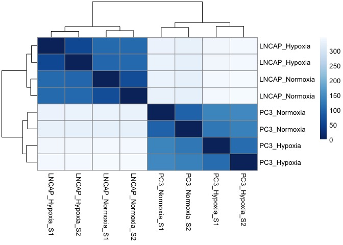

We observe that all the LNCaP samples cluster together and all the PC3 samples cluster together. Within each cell type, the hypoxia samples cluster together and the normoxia samples cluster together. These clustering patterns make sense, suggesting that the experiment was successful.

### 2. Variable Genes Heatmap

We can identify the genes that are driving the clustering between samples and display them in a heatmap. To do so, we first obtain the top most variable genes across samples by selecting the genes with the highest `rowVars()` value. Then, we plug the normalized counts for these genes into a heatmap using `pheatmap::pheatmap()`. The heatmap will cluster the samples based on expression similarity as well as display the genes that are associated with each cluster on the right-hand side. Note that the genes are simply chosen based on variability across samples. No statistical tests are performed to determine whether they are actually significantly different between groups.

``` r
variable_gene_heatmap <- function (vsd.obj, num_genes = 500, annotation, title = "") {
  brewer_palette <- "RdBu"
  # Ramp the color in order to get the scale.
  ramp <- colorRampPalette( RColorBrewer::brewer.pal(11, brewer_palette))
  mr <- ramp(256)[256:1]
  # get the stabilized counts from the vsd object
  stabilized_counts <- assay(vsd.obj)
  # calculate the variances by row(gene) to find out which genes are the most variable across the samples.
  row_variances <- rowVars(stabilized_counts)
  # get the top most variable genes
  top_variable_genes <- stabilized_counts[order(row_variances, decreasing=T)[1:num_genes],]
  # subtract out the means from each row, leaving the variances for each gene
  top_variable_genes <- top_variable_genes - rowMeans(top_variable_genes, na.rm=T)
  # replace the ensembl ids with the gene names
  gene_names <- annotation$Gene.name[match(rownames(top_variable_genes), annotation$Gene.stable.ID)]
  rownames(top_variable_genes) <- gene_names
  # reconstruct colData without sizeFactors for heatmap labeling
  coldata <- as.data.frame(vsd.obj@colData)
  coldata$sizeFactor <- NULL
  # draw heatmap using pheatmap
  pheatmap::pheatmap(top_variable_genes, color = mr, annotation_col = coldata, fontsize_col = 8, fontsize_row = 250/num_genes, border_color = NA, main = title)
}

variable_gene_heatmap(vsd, num_genes = 40, annotation = annotation)
```

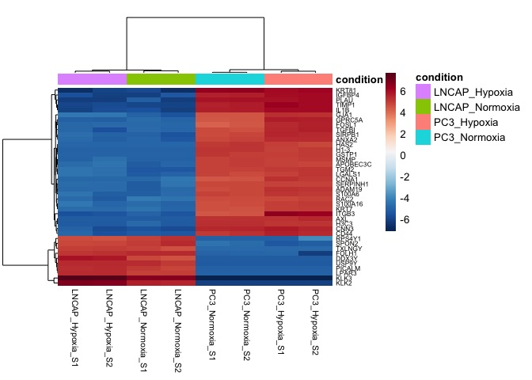

We see that the clustering is very similar to what we observed in the distance plot. There are a distinct set of genes that are specific to either LNCaP or PC3 cells. Given that we are analyzing data from cell lines, it is not surprising that the clustering is so clearly defined. If you are working with highly heterogenous samples (e.g. tissues), there may be significant variability across samples. Knowing the genes that are defining the differences between samples is useful for assessing whether there were sample preparation issues such as poor cell purity or tissue contamination.

### 3. PCA Plot

A principal components plot is another way to observe how diverse the samples are. As always, the samples which are most similar with each other in terms of their gene expression values will be closer to each other on the plot. This plot uses a Cartesian coordinate system, and the axes that are displayed correspond to the top two principal components that explain the majority of the variability in the data.

``` r
plot_PCA = function (vsd.obj) {
  pcaData <- plotPCA(vsd.obj,  intgroup = c("condition"), returnData = T)
  percentVar <- round(100 * attr(pcaData, "percentVar"))
  ggplot(pcaData, aes(PC1, PC2, color=condition)) +
    geom_point(size=3) +
    labs(x = paste0("PC1: ",percentVar[1],"% variance"),
         y = paste0("PC2: ",percentVar[2],"% variance"),
         title = "PCA Plot colored by condition") +
    ggrepel::geom_text_repel(aes(label = name), color = "black")
}
plot_PCA(vsd)
```

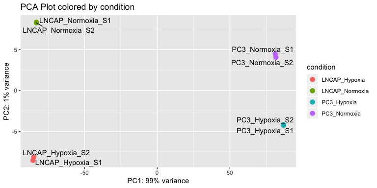

We observe that The LNCaP samples are furthest separated from the PC3 samples on the x-axis (PC1), which explains a whopping 99% of the variance in the dataset. Within each cell type, the normoxia samples are separated from the hypoxia samples. The amount of variability introduced by hypoxia is small compared to the inherent difference between the LNCaP and PC3 cell lines. If we are interested in the effects of hypoxia on gene expression, we should separate the LNCaP samples from the PC3 samples first, create separate DESeq2 objects, and then determine the effects of hypoxia on each cell line individually. I will cover how to do this in the next section.

Making subsetted DESeq2 objects
-------------------------------

Because a lot of the variability in the data is due to the difference in the background of the cell lines, we must create separate DESeq2 objects for the LNcaP and PC3 samples. The function `generate_DESeq_object()` below will make a DESeq2 object using your raw counts data and the two groups that you specify to compare. It will select the columns out from the raw data that match the group designations using `grep()`, build the `colData` matrix based on your group designations, and generate the DESeq2 object using `DESeqDataSetFromMatrix()` and `DESeq()`.

``` r
generate_DESeq_object <- function (my_data, groups) {
  data_subset1 <- my_data[,grep(str_c("^", groups[1]), colnames(my_data))]
  data_subset2 <- my_data[,grep(str_c("^", groups[2]), colnames(my_data))]
  my_countData <- cbind(data_subset1, data_subset2)
  condition <- c(rep(groups[1],ncol(data_subset1)), rep(groups[2],ncol(data_subset2)))
  my_colData <- as.data.frame(condition)
  rownames(my_colData) <- colnames(my_countData)
  print(my_colData)
  dds <- DESeqDataSetFromMatrix(countData = my_countData,
                              colData = my_colData,
                              design = ~ condition)
  dds <- DESeq(dds, quiet = T)
  return(dds)
}
```

The function should print the `colData` that was used to generate each DESeq2 object, so we can double check to make sure that the appropriate sample columns were selected and that the grouping was correct.

``` r
lncap <- generate_DESeq_object(data, c("LNCAP_Hypoxia", "LNCAP_Normoxia"))
```

    ##                        condition
    ## LNCAP_Hypoxia_S1   LNCAP_Hypoxia
    ## LNCAP_Hypoxia_S2   LNCAP_Hypoxia
    ## LNCAP_Normoxia_S1 LNCAP_Normoxia
    ## LNCAP_Normoxia_S2 LNCAP_Normoxia

``` r
pc3 <- generate_DESeq_object(data, c("PC3_Hypoxia", "PC3_Normoxia"))
```

    ##                    condition
    ## PC3_Hypoxia_S1   PC3_Hypoxia
    ## PC3_Hypoxia_S2   PC3_Hypoxia
    ## PC3_Normoxia_S1 PC3_Normoxia
    ## PC3_Normoxia_S2 PC3_Normoxia

Now that we have separated the LNCaP and PC3 samples, the `variable_gene_heatmap()` should display genes that are enriched in either the hypoxia vs normoxia conditions.

``` r
lncap_vsd <- vst(lncap, blind = T)
pc3_vsd <- vst(pc3, blind = T)
a <- variable_gene_heatmap(lncap_vsd, 30, annotation = annotation, title = "LNCaP variable genes")
```

``` r
b <- variable_gene_heatmap(pc3_vsd, 30, annotation = annotation, title = "PC3 variable genes")
```

``` r
gridExtra::grid.arrange(a[[4]],b[[4]], nrow = 1)
```

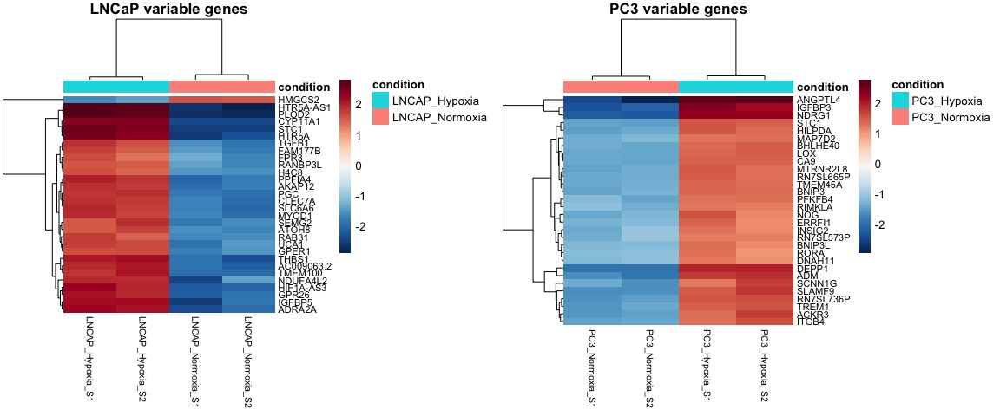

This is a vastly different set of genes than what was observed when we had samples from both cell lines combined. Our differential gene expression analysis should now yield a greater depth of genes for the comparison we care about: hypoxia vs normoxia.

Extracting DE results
---------------------

Now that we have assessed sample-to-sample variability and gained confidence that our experiment was performed correctly, we are ready to start answering the most pressing question: *what genes are differentially upregulated or downregulated by hypoxia in each cell line?* In this section, I will explain how to generate differential expression gene lists from DESeq2 objects.

To extract the differentially expressed genes from the DESeq2 object, we will use the `results()` function:

``` r
results(lncap, contrast = c("condition", "LNCAP_Hypoxia", "LNCAP_Normoxia"))
```

    ## log2 fold change (MLE): condition LNCAP_Hypoxia vs LNCAP_Normoxia
    ## Wald test p-value: condition LNCAP_Hypoxia vs LNCAP_Normoxia
    ## DataFrame with 60676 rows and 6 columns

    ##                    baseMean log2FoldChange     lfcSE       stat
    ## ENSG00000000003  520.186779     0.89074143 0.1775024  5.0181939
    ## ENSG00000000005    0.000000             NA        NA         NA
    ## ENSG00000000419 4974.737407    -0.08275249 0.1079697 -0.7664419
    ## ENSG00000000457  710.803637     0.47417029 0.1580068  3.0009481
    ## ENSG00000000460  492.462672    -0.12784678 0.1970602 -0.6487700
    ## ENSG00000000938    1.786214     0.50050523 2.3050236  0.2171367
    ##                       pvalue         padj
    ## ENSG00000000003 5.215951e-07 6.202081e-06
    ## ENSG00000000005           NA           NA
    ## ENSG00000000419 4.434134e-01 6.202886e-01
    ## ENSG00000000457 2.691405e-03 1.154137e-02
    ## ENSG00000000460 5.164870e-01 6.853607e-01
    ## ENSG00000000938 8.281018e-01           NA

We observe that the hypoxia condition was compared to the normoxia condition, and that there are columns corresponding to statistics calculated for each gene. The columns that you should pay the most attention to are `baseMean`, `log2FoldChange`, and `padj`.

-   The `baseMean` is a measure of the overall expression of the gene. We can assess whether is it a highly-expressed gene or if it is only barely above baseline.
-   The `log2FoldChange` measures how much higher the gene is in the hypoxia condition compared to the normoxia condition. Negative values mean the expression is higher in the normoxia group.
-   The `padj` column is a measure of how likely the gene is to be significantly different between the two conditions being compared.

We will use these metrics to filter, organize, and export lists of differentially expressed genes. I chose to use the following criteria:

1.  Select genes that are signifcantly different based on `padj`, in which the `padj` is lower than a specified cutoff value.
2.  Sort by `log2FoldChange` to identify the genes that are most highly up or down.
3.  (optional) Filter out genes that are very lowly-expressed (low `baseMean` values) which are not as likely to be biologically relevant. To do so, we can either use `baseMean` or we can calculate another metric called "counts per million" (cpm). The counts per million value is more intuitive because we can use a similar cutoff value across different sequencing experiments.
4.  Generate a ranked gene list file (`.rnk`), which is a list of all the genes in the dataset ordered by `log2FoldChange`. This file is required for Gene Set Enrichment Analysis, which I will explain in a later section of this guide.

Since there are many variations of sorting / filtering the data, I wrote the function `generate_DE_results()` to perform multiple filtering steps and provide output in the form of csv files. I export these files so they can be easily shared and interpreted by other bench scientists without having to read the data into R.

``` r
generate_DE_results <- function (dds, comparisons, padjcutoff = 0.001, log2cutoff = 0.5, cpmcutoff = 2) {
  # generate average counts per million metric from raw count data
  raw_counts <- counts(dds, normalized = F)
  cpms <- enframe(rowMeans(edgeR::cpm(raw_counts)))
  colnames(cpms) <- c("ensembl_id", "avg_cpm")

  # extract DESeq results between the comparisons indicated
  res <- results(dds, contrast = c("condition", comparisons[1], comparisons[2]))[,-c(3,4)]

  # annotate the data with gene name and average counts per million value
  res <- as_tibble(res, rownames = "ensembl_id")
  # read in the annotation and append it to the data
  my_annotation <- read.csv("GRCh38.p13_annotation.csv", header = T, stringsAsFactors = F)
  res <- left_join(res, my_annotation, by = c("ensembl_id" = "Gene.stable.ID"))
  # append the average cpm value to the results data
  res <- left_join(res, cpms, by = c("ensembl_id" = "ensembl_id"))

  # combine normalized counts with entire DE list
  normalized_counts <- round(counts(dds, normalized = TRUE),3)
  pattern <- str_c(comparisons[1], "|", comparisons[2])
  combined_data <- as_tibble(cbind(res, normalized_counts[,grep(pattern, colnames(normalized_counts))] ))
  combined_data <- combined_data[order(combined_data$log2FoldChange, decreasing = T),]

  # make ordered rank file for GSEA, selecting only protein coding genes
  res_prot <- res[which(res$Gene.type == "protein_coding"),]
  res_prot_ranked <- res_prot[order(res_prot$log2FoldChange, decreasing = T),c("Gene.name", "log2FoldChange")]
  res_prot_ranked <- na.omit(res_prot_ranked)
  res_prot_ranked$Gene.name <- str_to_upper(res_prot_ranked$Gene.name)

  # generate sorted lists with the indicated cutoff values
  res <- res[order(res$log2FoldChange, decreasing=TRUE ),]
  de_genes_padj <- res[which(res$padj < padjcutoff),]
  de_genes_log2f <- res[which(abs(res$log2FoldChange) > log2cutoff & res$padj < padjcutoff),]
  de_genes_cpm <- res[which(res$avg_cpm > cpmcutoff & res$padj < padjcutoff),]

  # write output to files
  write.csv (de_genes_padj, file = paste0(comparisons[1], "_vs_", comparisons[2], "_padj_cutoff.csv"), row.names =F)
  write.csv (de_genes_log2f, file = paste0(comparisons[1], "_vs_", comparisons[2], "_log2f_cutoff.csv"), row.names =F)
  write.csv (de_genes_cpm, file = paste0(comparisons[1], "_vs_", comparisons[2], "_cpm_cutoff.csv"), row.names =F)
  write.csv (combined_data, file = paste0(comparisons[1], "_vs_", comparisons[2], "_allgenes.csv"), row.names =F)
  write.table (res_prot_ranked, file = paste0(comparisons[1], "_vs_", comparisons[2], "_rank.rnk"), sep = "\t", row.names = F, quote = F)

  writeLines( paste0("For the comparison: ", comparisons[1], "_vs_", comparisons[2], ", out of ", nrow(combined_data), " genes, there were: \n",
               nrow(de_genes_padj), " genes below padj ", padjcutoff, "\n",
               nrow(de_genes_log2f), " genes below padj ", padjcutoff, " and above a log2FoldChange of ", log2cutoff, "\n",
               nrow(de_genes_cpm), " genes below padj ", padjcutoff, " and above an avg cpm of ", cpmcutoff, "\n",
               "Gene lists ordered by log2fchange with the cutoffs above have been generated.") )
  gene_count <- tibble (cutoff_parameter = c("padj", "log2fc", "avg_cpm" ),
                        cutoff_value = c(padjcutoff, log2cutoff, cpmcutoff),
                        signif_genes = c(nrow(de_genes_padj), nrow(de_genes_log2f), nrow(de_genes_cpm)))
  invisible(gene_count)
}
```

After running the function, the console should display the number of genes that passed each filtering critera:

``` r
lncap_output <- generate_DE_results (lncap, c("LNCAP_Hypoxia", "LNCAP_Normoxia"))
```

    ## For the comparison: LNCAP_Hypoxia_vs_LNCAP_Normoxia, out of 60676 genes, there were:
    ## 2897 genes below padj 0.001
    ## 2654 genes below padj 0.001 and above a log2FoldChange of 0.5
    ## 2729 genes below padj 0.001 and above an avg cpm of 2
    ## Gene lists ordered by log2fchange with the cutoffs above have been generated.

``` r
pc3_output <- generate_DE_results(pc3, c("PC3_Hypoxia", "PC3_Normoxia"))
```

    ## For the comparison: PC3_Hypoxia_vs_PC3_Normoxia, out of 60676 genes, there were:
    ## 1606 genes below padj 0.001
    ## 1362 genes below padj 0.001 and above a log2FoldChange of 0.5
    ## 1552 genes below padj 0.001 and above an avg cpm of 2
    ## Gene lists ordered by log2fchange with the cutoffs above have been generated.

We should also see a set of csv files show up in the same folder as the R script. We can read in the output files with `read.csv()` and observe what the file structure is like:

``` r
res <- read.csv("LNCAP_Hypoxia_vs_LNCAP_Normoxia_allgenes.csv", header = T)
head(res)
```

    ##        ensembl_id baseMean log2FoldChange       pvalue         padj
    ## 1 ENSG00000283339 39.80668       8.825414 7.430094e-09 1.237992e-07
    ## 2 ENSG00000203664 35.44453       8.655707 1.916346e-08 2.933740e-07
    ## 3 ENSG00000261051 21.18835       7.915735 6.892832e-07 7.985314e-06
    ## 4 ENSG00000171954 20.04605       7.834644 1.015440e-06 1.131000e-05
    ## 5 ENSG00000276107 16.69813       7.575064 4.423505e-06 4.248312e-05
    ## 6 ENSG00000204136 81.25640       7.409162 7.029614e-12 1.760071e-10
    ##    Gene.name                          Gene.type   avg_cpm LNCAP_Hypoxia_S1
    ## 1 AC093726.3             unprocessed_pseudogene 0.9578540           75.727
    ## 2      OR2W5 transcribed_unprocessed_pseudogene 0.8520883           83.523
    ## 3 AC107021.2                             lncRNA 0.5098586           40.091
    ## 4    CYP4F22                     protein_coding 0.4821528           42.318
    ## 5 AC037198.1                             lncRNA 0.4023290           21.159
    ## 6     GGTA1P     transcribed_unitary_pseudogene 1.9541496          172.613
    ##   LNCAP_Hypoxia_S2 LNCAP_Normoxia_S1 LNCAP_Normoxia_S2
    ## 1           83.500             0.000             0.000
    ## 2           58.255             0.000             0.000
    ## 3           44.663             0.000             0.000
    ## 4           37.866             0.000             0.000
    ## 5           45.633             0.000             0.000
    ## 6          150.493             1.057             0.862

The `_allgenes.csv` file will be used in the next section for visualizations. It is an aggregate of all the data we have curated so far: the `results()` output, the gene annotations, and the normalized counts for every gene. We can further organize/filter the data for the visualizations based on user preferences. The other csv files, such as `_padj_cutoff.csv`, can be distributed to researchers who are only interested in the gene lists.

Visualizations for DE results
-----------------------------

Now that we have extracted the results from our DESeq2 object, we can start visualizing the differentially expressed genes. In this section, I will showcase some plotting functions that I wrote to answer questions such as:

1.  How is a given gene of interest expressed across groups?
2.  What is the sample-to-sample variability for the top differentially expressed genes?
3.  Are there more upregulated or downregulated genes?
4.  If we are performing multiple comparisons, which differentially expressed genes are shared?
5.  What gene pathways are enriched in one group vs another?

### 1. PlotCounts (upgraded)

We are often interested in plotting the normalized counts for certain genes of interest, in order to get a sense of the spread of the data and how genes are expressed across each of the groups. This is especially of interest for genes that show up as differentially expressed in our DESeq2 results. A way to plot the normalized counts for each sample is by using the built-in `DESeq2::plotCounts()` function. However, this function leaves *a lot* to be desired. As an example, I plot the gene IGFBP1 (a hypoxia-inducible gene) using its Ensembl ID below.

``` r
plotCounts(dds, gene="ENSG00000146678", intgroup="condition")
```

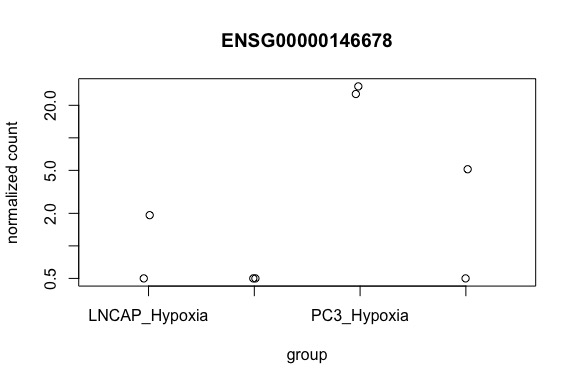

As you can see, the sample names aren't even all displayed if their names are too long. We can instead use ggplot2 to graph the data, by extracting the normalized counts using `returnData = TRUE`:

``` r
d <- plotCounts(dds, gene="ENSG00000146678", intgroup="condition", returnData=TRUE)
d
```

    ##                       count      condition
    ## LNCAP_Hypoxia_S1   0.500000  LNCAP_Hypoxia
    ## LNCAP_Hypoxia_S2   1.924969  LNCAP_Hypoxia
    ## LNCAP_Normoxia_S1  0.500000 LNCAP_Normoxia
    ## LNCAP_Normoxia_S2  0.500000 LNCAP_Normoxia
    ## PC3_Hypoxia_S1    29.924182    PC3_Hypoxia
    ## PC3_Hypoxia_S2    25.451380    PC3_Hypoxia
    ## PC3_Normoxia_S1    0.500000   PC3_Normoxia
    ## PC3_Normoxia_S2    5.120501   PC3_Normoxia

``` r
ggplot(d, aes(x=condition, y=count)) +
  geom_point(position=position_jitter(w=0.1,h=0), aes (color = condition)) +
  scale_y_log10(breaks=c(25,100,400))
```

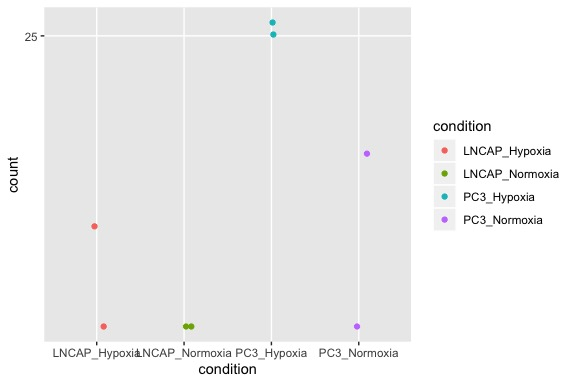

However, this is still very frustrating to work with, since we have to input the Ensembl ID instead of a gene name. Researchers typically want to search by gene name, and this function forces us to look up the Ensembl ID each time. To solve this problem, I wrote my own function `plot_counts()` to accept either the gene name, Ensembl ID, or an index such as `which.min(res$padj)`. I also provide two ways to normalize the data: by counts per million (cpm) or using the built-in DESeq2 normalized counts.

``` r
plot_counts <- function (dds, gene, normalization = "DESeq2"){
  # read in the annotation file
  annotation <- read.csv("GRCh38.p13_annotation.csv", header = T, stringsAsFactors = F)
  # obtain normalized data
  if (normalization == "cpm") {
    normalized_data <- cpm(counts(dds, normalized = F)) # normalize the raw data by counts per million
  } else if (normalization == "DESeq2")
    normalized_data <- counts(dds, normalized = T) # use DESeq2 normalized counts
  # get sample groups from colData
  condition <- dds@colData$condition
  # get the gene name from the ensembl id
  if (is.numeric(gene)) { # check if an index is supplied or if ensembl_id is supplied
    if (gene%%1==0 )
      ensembl_id <- rownames(normalized_data)[gene]
    else
      stop("Invalid index supplied.")
  } else if (gene %in% annotation$Gene.name){ # check if a gene name is supplied
    ensembl_id <- annotation$Gene.stable.ID[which(annotation$Gene.name == gene)]
  } else if (gene %in% annotation$Gene.stable.ID){
    ensembl_id <- gene
  } else {
    stop("Gene not found. Check spelling.")
  }
  expression <- normalized_data[ensembl_id,]
  gene_name <- annotation$Gene.name[which(annotation$Gene.stable.ID == ensembl_id)]
  # construct a tibble with the grouping and expression
  gene_tib <- tibble(condition = condition, expression = expression)
  ggplot(gene_tib, aes(x = condition, y = expression))+
    geom_boxplot(outlier.size = NULL)+
    geom_point()+
    labs (title = paste0("Expression of ", gene_name, " - ", ensembl_id), x = "group", y = paste0("Normalized expression (", normalization , ")"))+
    theme(axis.text.x = element_text(size = 11), axis.text.y = element_text(size = 11))
}

plot_counts(dds, "IGFBP1")
```

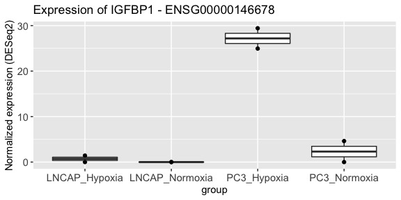

We observe that IGFBP1 is elevated in the the hypoxia conditions relative to the respective normoxia controls. Interestingly, the upregulation of IGFBP1 is much higher in PC3 cells than in LNCaP cells. This is a nice example of how this plot is useful to determine relative expression levels between samples.

### 2. Differential gene heatmap

The most common heatmap used to display RNA-seq results is the differential gene heatmap. This is a heatmap where the normalized values for each sample are plotted for the top most upregulated genes which are significantly different between the comparison groups. Starting from the results object, we first filter the results by `padj` and then take the genes which have the greatest `log2FoldChange` value. The normalized counts for each gene is scaled by row (across samples) in order to emphasize the difference between the comparison groups (hypoxia vs normoxia). The purpose of this visualization is to give a sense of how variable the data are from sample to sample, as well as to quickly examine the top differential genes. I wrote the function `DE_gene_heatmap()` to generate this plot, using `pheatmap::pheatmap()` with the `scale = "row"` argument.

``` r
res <- read.csv ("LNCAP_Hypoxia_vs_LNCAP_Normoxia_allgenes.csv", header = T)

DE_gene_heatmap <- function(res, padj_cutoff = 0.0001, ngenes = 20) {
  # generate the color palette
  brewer_palette <- "RdBu"
  ramp <- colorRampPalette(RColorBrewer::brewer.pal(11, brewer_palette))
  mr <- ramp(256)[256:1]
  # obtain the significant genes and order by log2FoldChange
  significant_genes <- res %>% filter(padj < padj_cutoff) %>% arrange (desc(log2FoldChange)) %>% head (ngenes)
  heatmap_values <- as.matrix(significant_genes[,-c(1:8)])
  rownames(heatmap_values) <- significant_genes$Gene.name
  # plot the heatmap using pheatmap
  pheatmap::pheatmap(heatmap_values, color = mr, scale = "row", fontsize_col = 10, fontsize_row = 200/ngenes, fontsize = 5, border_color = NA)
}
DE_gene_heatmap(res, 0.001, 30)
```

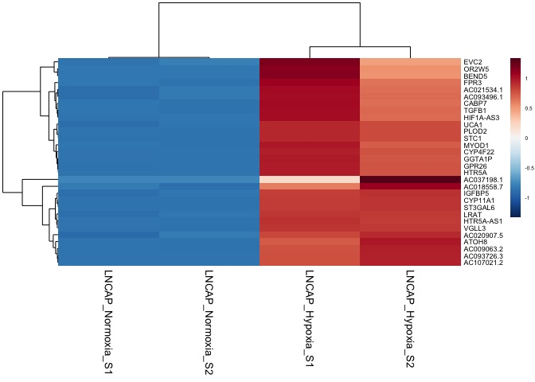

We observe that expression of the differential genes is very consistent within groups. We are also able to identify that LNCAP\_Hypoxia\_S1 has higher expression of the top ~10 genes than LNCAP\_Hypoxia\_S2.

### 3. Volcano Plot

Another common visualization for bulk RNA-seq is the volcano plot, which is a scatterplot that displays the `log2FoldChange` value vs the `-log(padj)` value for each gene in the comparison. We can use this plot to quickly identify genes that are highly upregulated or downregulated, or identify genes that have highly significant p-values. Below is an example volcano plot showing the most significant genes in the hypoxia vs normoxia comparison for LNCaP cells.

``` r
res <- read.csv ("LNCAP_Hypoxia_vs_LNCAP_Normoxia_allgenes.csv", header = T)

plot_volcano <- function (res, padj_cutoff, nlabel = 10, label.by = "padj"){
  # assign significance to results based on padj
  res <- mutate(res, significance=ifelse(res$padj<padj_cutoff, paste0("padj < ", padj_cutoff), paste0("padj > ", padj_cutoff)))
  res = res[!is.na(res$significance),]
  significant_genes <- res %>% filter(significance == paste0("padj < ", padj_cutoff))

  # get labels for the highest or lowest genes according to either padj or log2FoldChange
  if (label.by == "padj") {
    top_genes <- significant_genes %>% arrange(padj) %>% head(nlabel)
    bottom_genes <- significant_genes %>% filter (log2FoldChange < 0) %>% arrange(padj) %>% head (nlabel)
  } else if (label.by == "log2FoldChange") {
    top_genes <- head(arrange(significant_genes, desc(log2FoldChange)),nlabel)
    bottom_genes <- head(arrange(significant_genes, log2FoldChange),nlabel)
  } else
    stop ("Invalid label.by argument. Choose either padj or log2FoldChange.")

  ggplot(res, aes(log2FoldChange, -log(padj))) +
    geom_point(aes(col=significance)) +
    scale_color_manual(values=c("red", "black")) +
    ggrepel::geom_text_repel(data=top_genes, aes(label=head(Gene.name,nlabel)), size = 3)+
    ggrepel::geom_text_repel(data=bottom_genes, aes(label=head(Gene.name,nlabel)), color = "#619CFF", size = 3)+
    labs ( x = "Log2FoldChange", y = "-(Log normalized p-value)")+
    geom_vline(xintercept = 0, linetype = "dotted")+
    theme_minimal()
}

plot_volcano(res, 0.0005, nlabel = 15, label.by = "padj")
```

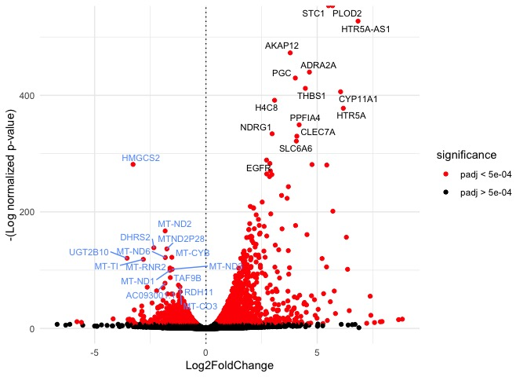

The downregulated genes are labeled in a different color compared to the upregulated genes. We observe that there are a lot more significantly upregulated genes than there are downregulated genes. Given that we are looking for gene expression changes in cells grown in hypoxic conditions compared to normoxic conditions, this suggests that cells may be ramping up transcription of response pathways.

### 4. LogFoldChange comparison plot

Given that we have performed differential gene expression analysis on two different cell lines, we would like to compare the two lines in terms of how their gene expression responds to hypoxia. We want to answer questions such as:

1.  Are the genes that are induced by hypoxia similar in both cell lines?
2.  Which significant genes are shared by both cell lines and which genes are unique to each cell line?

To do so, we can take the significant genes from the hypoxia vs normoxia comparison for both lines and generate a scatterplot of their `log2FoldChange` values using the custom function below, `compare_significant_genes()`. This function will display the overlap in the gene lists by color coding significant genes that are shared by both cell lines, as well as those that are unique to each individual cell line.

``` r
res1 <- read.csv ("LNCAP_Hypoxia_vs_LNCAP_Normoxia_allgenes.csv", header = T)
res2 <- read.csv ("PC3_Hypoxia_vs_PC3_Normoxia_allgenes.csv", header = T)

compare_significant_genes <- function (res1, res2, padj_cutoff=0.0001, ngenes=250, nlabel=10, samplenames=c("comparison1", "comparison2"), title = "" ) {
  # get list of most upregulated or downregulated genes for each results table
  genes1 <- rbind(head(res1[which(res1$padj < padj_cutoff),], ngenes), tail(res1[which(res1$padj < padj_cutoff),], ngenes))
  genes2 <- rbind(head(res2[which(res2$padj < padj_cutoff),], ngenes), tail(res2[which(res2$padj < padj_cutoff),], ngenes))

   # combine the data from both tables
  de_union <- union(genes1$ensembl_id,genes2$ensembl_id)
  res1_union <- res1[match(de_union, res1$ensembl_id),][c("ensembl_id", "log2FoldChange", "Gene.name")]
  res2_union <- res2[match(de_union, res2$ensembl_id),][c("ensembl_id", "log2FoldChange", "Gene.name")]
  combined <- left_join(res1_union, res2_union, by = "ensembl_id", suffix = samplenames )

  # identify overlap between genes in both tables
  combined$de_condition <- 1 # makes a placeholder column
  combined$de_condition[which(combined$ensembl_id %in% intersect(genes1$ensembl_id,genes2$ensembl_id))] <- "Significant in Both"
  combined$de_condition[which(combined$ensembl_id %in% setdiff(genes1$ensembl_id,genes2$ensembl_id))] <- paste0("Significant in ", samplenames[1])
  combined$de_condition[which(combined$ensembl_id %in% setdiff(genes2$ensembl_id,genes1$ensembl_id))] <- paste0("Significant in ", samplenames[2])
  combined[is.na(combined)] <- 0

  # find the top most genes within each condition to label on the graph
  label1 <- rbind(head(combined[which(combined$de_condition==paste0("Significant in ", samplenames[1])),],nlabel),
                  tail(combined[which(combined$de_condition==paste0("Significant in ", samplenames[1])),],nlabel))
  label2 <- rbind(head(combined[which(combined$de_condition==paste0("Significant in ", samplenames[2])),],nlabel),
                  tail(combined[which(combined$de_condition==paste0("Significant in ", samplenames[2])),],nlabel))
  label3 <- rbind(head(combined[which(combined$de_condition=="Significant in Both"),],nlabel),
                  tail(combined[which(combined$de_condition=="Significant in Both"),],nlabel))
  combined_labels <- rbind(label1,label2,label3)

  # plot the genes based on log2FoldChange, color coded by significance
  ggplot(combined, aes_string(x = paste0("log2FoldChange", samplenames[1]), y = paste0("log2FoldChange", samplenames[2]) )) +
      geom_point(aes(color = de_condition), size = 0.7)+
      scale_color_manual(values= c("#00BA38", "#619CFF", "#F8766D"))+
      ggrepel::geom_text_repel(data= combined_labels, aes_string(label=paste0("Gene.name", samplenames[1]), color = "de_condition"), show.legend = F, size=3)+
      geom_vline(xintercept = c(0,0), size = 0.3, linetype = 2)+
      geom_hline(yintercept = c(0,0), size = 0.3, linetype = 2)+
      labs(title = title,x = paste0("log2FoldChange in ", samplenames[1]), y = paste0("log2FoldChange in ", samplenames[2]))+
      theme_minimal()+
      theme(legend.title = element_blank())
}

compare_significant_genes(res1,res2, samplenames = c("LNCaP", "PC3"), title = "Hypoxia-induced gene expression differences in LNCaP vs PC3 cells")  
```

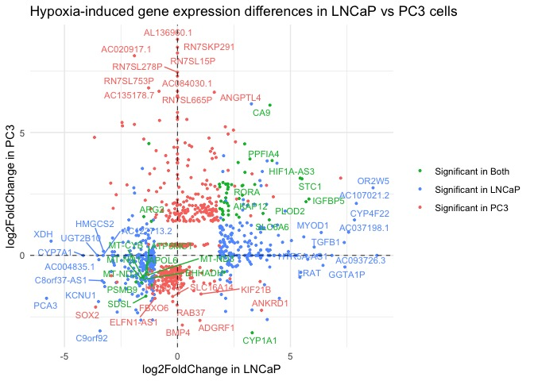

We observe that there are indeed a small subset of genes that are differentially expressed in both the LNCaP as well as PC3 comparisons (green labels). It is satisfying to see that the majority of these shared genes fall along the x = y diagonal. For example, genes such as CA9, IGFBP5, STC1, and PPFIA4 are greatly induced by hypoxia in both lines. These genes are more likely to be real indicators of the hypoxia response. In contrast, the genes that are significant in only one cell line mostly lie on the vertical or horizontal axis. These genes are likely associated with responses specific to the background of each cell line, and are unlikely to be universal indicators of hypoxia.

### 5. Gene set enrichment analysis

Gene Set Enrichment Analysis (GSEA) can be used to test whether pathways consisting of multiple genes are enriched in one group compared to another. For example, there is a "gene set" of 200 genes that composes the hypoxia pathway. We would like to determine whether the genes associated with the hypoxia pathway are collectively upregulated in the hypoxia condition, as a way to verify that the experiment was performed correctly. We also want to determine which other pathways hypoxia is affecting inside the cell.

To perform GSEA, we have to rank every gene available in terms of how much higher or lower it is in group A vs group B. This is called a ranked list, and we have already generated one in the above section using the function `generate_DE_results()`. We can plug this ranked list into either the GSEA application from the Broad Institute (<https://www.gsea-msigdb.org/gsea/index.jsp>), or into the R package `fgsea` from Bioconductor (<https://bioconductor.org/packages/release/bioc/html/fgsea.html>). If you choose to use the GSEA application rather than the R package, the ranked lists have to be in a very specific format. The genes must be all upper-case, and file should contain one column for the gene name and another column with the corresponding logfoldchange. Here, we will be using the R package `fgsea` to perform GSEA.

The R package `fgsea` can be installed from Bioconductor using the commands:

``` r
if (!requireNamespace("BiocManager", quietly = TRUE))
    install.packages("BiocManager")
BiocManager::install("fgsea")
```

We also need to download the pathway files from the GSEA MSigDB webpage at: <https://www.gsea-msigdb.org/gsea/msigdb/collections.jsp> and load them in using `fgsea::gmtPathways()`. I will be working with the HALLMARK pathway set.

``` r
library(fgsea)
# read in file containing lists of genes for each pathway
hallmark_pathway <- gmtPathways("h.all.v7.0.symbols.gmt.txt")
head(names(hallmark_pathway))
```

    ## [1] "HALLMARK_TNFA_SIGNALING_VIA_NFKB"   
    ## [2] "HALLMARK_HYPOXIA"                   
    ## [3] "HALLMARK_CHOLESTEROL_HOMEOSTASIS"   
    ## [4] "HALLMARK_MITOTIC_SPINDLE"           
    ## [5] "HALLMARK_WNT_BETA_CATENIN_SIGNALING"
    ## [6] "HALLMARK_TGF_BETA_SIGNALING"

The pathway file is loaded as a list of gene sets. We can access the genes for each pathway by selecting the pathway name using `$`:

``` r
head(hallmark_pathway$HALLMARK_HYPOXIA, 20)
```

    ##  [1] "PGK1"    "PDK1"    "GBE1"    "PFKL"    "ALDOA"   "ENO2"    "PGM1"   
    ##  [8] "NDRG1"   "HK2"     "ALDOC"   "GPI"     "MXI1"    "SLC2A1"  "P4HA1"  
    ## [15] "ADM"     "P4HA2"   "ENO1"    "PFKP"    "AK4"     "FAM162A"

After loading the pathways, we have to turn our ranked list into a vector, in which the `log2FoldChange` value is named with the gene name. We also need to get rid of any NA values or duplicate gene entries. The custom function `prepare_ranked_list()` will perform these operations.

``` r
# load the ranked list
lncap_ranked_list <- read.table("LNCAP_Hypoxia_vs_LNCAP_Normoxia_rank.rnk", header = T, stringsAsFactors = F)
head(lncap_ranked_list)
```

    ##   Gene.name log2FoldChange
    ## 1   CYP4F22       7.834644
    ## 2     TGFB1       7.380095
    ## 3     BEND5       7.223460
    ## 4     RXFP1       6.700811
    ## 5     KRT72       6.574523
    ## 6      LRAT       6.440758

``` r
# formats the ranked list for the fgsea() function
prepare_ranked_list <- function(ranked_list) {
  # if duplicate gene names present, average the values
  if( sum(duplicated(ranked_list$Gene.name)) > 0) {
    ranked_list <- aggregate(.~Gene.name, FUN = mean, data = ranked_list)
    ranked_list <- ranked_list[order(ranked_list$log2FoldChange, decreasing = T),]
  }
  # omit rows with NA values
  ranked_list <- na.omit(ranked_list)
  # turn the dataframe into a named vector
  ranked_list <- tibble::deframe(ranked_list)
  ranked_list
}

lncap_ranked_list <- prepare_ranked_list(lncap_ranked_list)
head(lncap_ranked_list)
```

    ##  CYP4F22    TGFB1    BEND5    RXFP1    KRT72     LRAT
    ## 7.834644 7.380095 7.223460 6.700811 6.574523 6.440758

Now that we have the named vector, we can plug it into the `fgsea()` function along with the hallmark pathways object. This will generate a table of results containing the enrichment scores associated with each pathway.

``` r
# generate GSEA results table using fgsea() by inputting the pathway list and ranked list
fgsea_results <- fgsea(pathways = hallmark_pathway,
                  stats = lncap_ranked_list,
                  minSize = 15,
                  maxSize = 500,
                  nperm= 1000)

fgsea_results %>% arrange (desc(NES)) %>% select (pathway, padj, NES) %>% head()
```

    ##                       pathway       padj      NES
    ## 1            HALLMARK_HYPOXIA 0.01214772 2.183089
    ## 2  HALLMARK_ANDROGEN_RESPONSE 0.01214772 1.911479
    ## 3       HALLMARK_ANGIOGENESIS 0.01214772 1.893114
    ## 4         HALLMARK_GLYCOLYSIS 0.01214772 1.874638
    ## 5 HALLMARK_TGF_BETA_SIGNALING 0.01214772 1.838240
    ## 6     HALLMARK_UV_RESPONSE_DN 0.01214772 1.778000

The normalized enrichment scores (NES) tell us how much more enriched the pathway is in the hypoxia samples compared to the normoxia samples. As expected, we observe that the most enriched pathway in response to hypoxia is the HALLMARK\_HYPOXIA pathway.

We can visualize the statistics for each pathway using a "waterfall" plot, which is a sideways bar plot of normalized enrichment scores for each of the pathways, color-coded by significance. This plot is great for quickly identifying the significantly enriched pathways.

``` r
waterfall_plot <- function (fsgea_results, graph_title) {
  fgsea_results %>%
    mutate(short_name = str_split_fixed(pathway, "_",2)[,2])%>% # removes 'HALLMARK_' from the pathway title
    ggplot( aes(reorder(short_name,NES), NES)) +
      geom_bar(stat= "identity", aes(fill = padj<0.05))+
      coord_flip()+
      labs(x = "Hallmark Pathway", y = "Normalized Enrichment Score", title = graph_title)+
      theme(axis.text.y = element_text(size = 7),
            plot.title = element_text(hjust = 1))
}

waterfall_plot(fgsea_results, "Hallmark pathways altered by hypoxia in LNCaP cells")
```

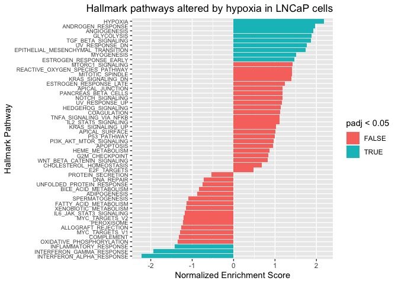

In addition to the hypoxia pathway, the androgen response and MTORC1 signaling pathways also appear to be significantly enriched in hypoxic conditions. Some interesting metabolic changes are also occuring. Similar to the Warburg effect, we observe that the glycolysis pathway is greatly enriched in the hypoxia condition, and that oxidative phosphorylation is negatively enriched. Since tumors become progressively hypoxic during cancer progression, this data may suggest that the hypoxic conditions are a driver of the metabolic switch from oxidative phosphorylation to glycolysis as an energy source.

Interestingly, the interferon response pathways are both negatively enriched in hypoxic conditions, suggesting that hypoxic cells may be less able to respond to interferons. Given that the cells were cultured in vitro (an environment where interferons are probably not present), I find this result unexpected.

We can also narrow in on specific pathways of interest by plotting "enrichment curves" using the function `fgsea::plotEnrichment()`. In these plots, the black ticks on the x-axis indicate a gene in the pathway, and the green curve is a measure of how enriched the genes are for either the hypoxia group (left side) or the normoxia group (right side). Example curves for pathways highly enriched in either hypoxia or normoxia are shown below.

``` r
# wrapper for fgsea::plotEnrichment()
plot_enrichment <- function (geneset, pathway, ranked_list) {
  plotEnrichment(geneset[[pathway]], ranked_list)+labs (title = pathway)
}
# example of positively enriched pathway (up in Hypoxia)
plot_enrichment(hallmark_pathway, "HALLMARK_GLYCOLYSIS" , lncap_ranked_list)
```

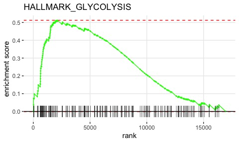

``` r
# example of negatively enriched pathway (down in Hypoxia)
plot_enrichment(hallmark_pathway, "HALLMARK_OXIDATIVE_PHOSPHORYLATION" , lncap_ranked_list)
```

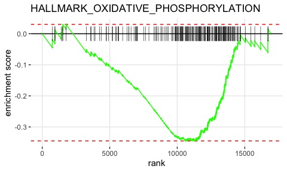

These types of enrichment curves are commonly shown in scientific publications to emphasize upregulation / downregulation of specific pathways of interest.

Conclusion
----------

Here, I have shown you a complete bulk RNA-sequencing analysis pipeline, starting from downloading and processing the raw sequencing files all the way to creating visualizations for differentially expressed genes and pathways. From our analysis, we have observed that:

1.  LNCaP cells and PC3 cells differ vastly in their global gene expression profiles.
2.  Both cell lines upregulate a shared set of genes under hypoxic conditions.
3.  Hypoxia upregulates genes associated with glycolysis and downregulates genes associated with oxidative phosphorylation, suggesting that a metabolic switch is occuring.

We have generated differential expression gene lists for each cell line, which can be explored for novel genes associated with the hypoxia response. Furthermore, we have learned how to produce several different types of visualizations that can be used to display and explore bulk RNA-sequencing data.

I hope my analysis pipepline has helped you make sense of your bulk RNA-sequencing data. If you are also interested in learning about single-cell RNA-sequencing data analysis, I have a comprehensive guide written at <https://erilu.github.io/single-cell-rnaseq-analysis/>. Thanks for reading!
